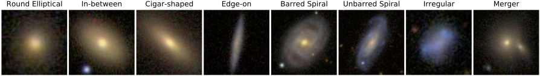
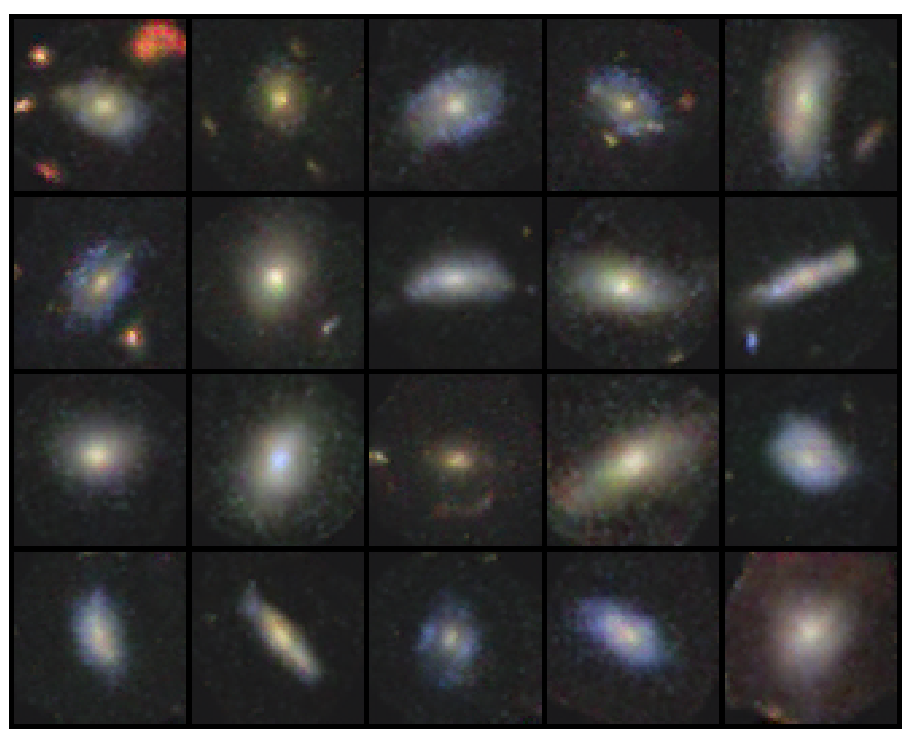
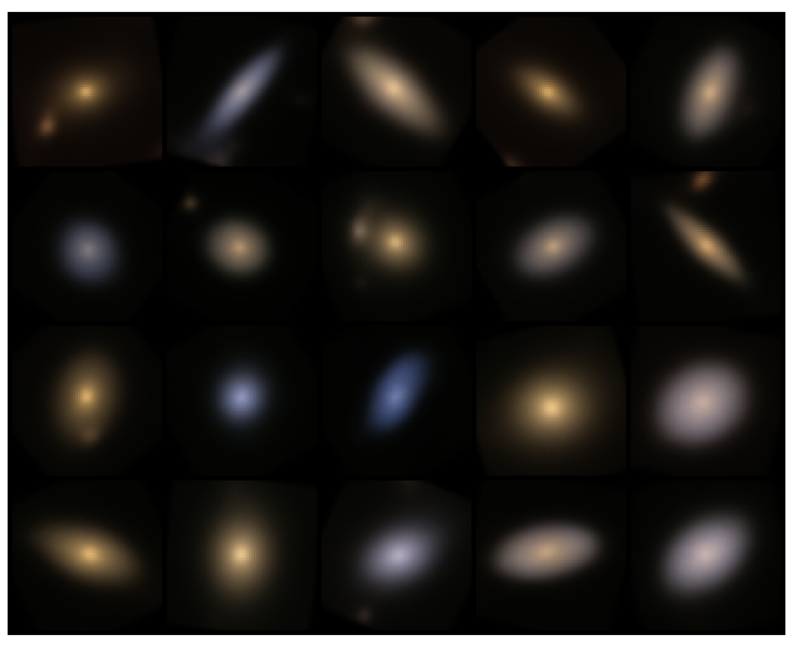

# Galaxy Zoo Image Generators

The repository explores various generative models for generating fake galaxy images.

## Data

- The **image** data is available from [Kaggle : Galaxy Zoo 2 images](https://www.kaggle.com/datasets/jaimetrickz/galaxy-zoo-2-images). 

- The **galaxy morphological label** data is constructed from the catalog of [Hart et al. 2016](https://academic.oup.com/mnras/article/461/4/3663/2608720) available from the [Galaxy Zoo Project official website](https://data.galaxyzoo.org).

- The baseline dataset consists of **155,951** galaxies.

- See [this notebook](./notebooks/%5Bdata%20exploration%5D%20GalaxyZoo%20Image%20DataSet.ipynb) for dataset visualization.

- Galaxy Morphology Types : 

&emsp;&emsp;&emsp;&emsp; 

## Overview

There are currently two generative models available.

### Deep Convolutional Generative Adversarial Network (DCGAN)

- DCGAN network architecture adopted from [Radford et al. 2015](https://arxiv.org/pdf/1511.06434.pdf). The implementation in this repo follows this [PyTorch tutorial](https://pytorch.org/tutorials/beginner/dcgan_faces_tutorial.html).

- Source code 
    - Network structure : [dcgan.py](./galaxy_generator/models/dcgan.py)
    - Main training & generator code : [dcgan_generator.py](./galaxy_generator/dcgan_generator.py)

### Variational Autoencoder (VAE)

- The VAE's decoder netork is designed to closely follow the convolutional block design of the generator in DCGAN. The encoder part of the VAE is a mirror symmetry of the decoder. This way we can then compare the performance of the DCGAN generator and the VAE decoder condictioned on the total number of trainable parameters in the generator part of the networks, yet with different learning frameworks.

- Source code
    - Network structure : [vae.py](./galaxy_generator/models/vae.py)
    - Main training & generator code : [vae_generator.py](./galaxy_generator/vae_generator.py)
    

## Usage

- To train the network, specify the parameter settings in a yaml file located in the **configs** directory.  
&emsp; Parameter settings for training DCGAN : [dcgan_test.yaml](./configs/dcgan_test.yaml)  
&emsp; Parameter settings for training VAE : [vae_test.yaml](./configs/vae_test.yaml)

- Then run the training scripts located in **bin** via:  
&emsp;`python3 bin/train_dcgan.py --config configs/dcgan_test.yaml > experiments/dcgan_test.log`  
&emsp; or  
&emsp;`python3 bin/train_vae.py --config configs/vae_test.yaml > experiments/vae_test.log`   
 
&emsp; Alternatively, one can also train the network following the demo notebooks :  
&emsp;&emsp; [[demo] dcgan example training run.ipynb](https://github.com/hungjinh/GalaxyZooGenerator/blob/master/notebooks/%5Bdemo%5D%20dcgan%20example%20training%20run.ipynb)  
&emsp;&emsp; [[demo] VAE example training run.ipynb](https://github.com/hungjinh/GalaxyZooGenerator/blob/master/notebooks/%5Bdemo%5D%20VAE%20example%20training%20run.ipynb)  

## Results

### Fake galaxies generated from DCGAN

- Results of the **best trained DCGAN galaxy generator** can be viewed in [this notebook](./notebooks/%5Bbest%20model%5D%20dcgan.ipynb).

&emsp;&emsp;&emsp;&emsp; 

### Fake galaxies generated from VAE

- Results of the **best trained VAE galaxy generator** can be viewed in [this notebook](./notebooks/%5Bbest%20model%5D%20VAE.ipynb).

&emsp;&emsp;&emsp;&emsp; 

